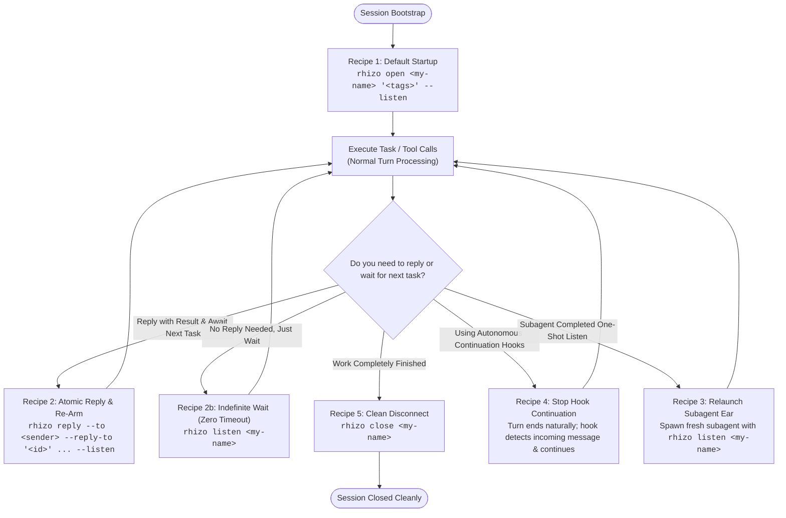
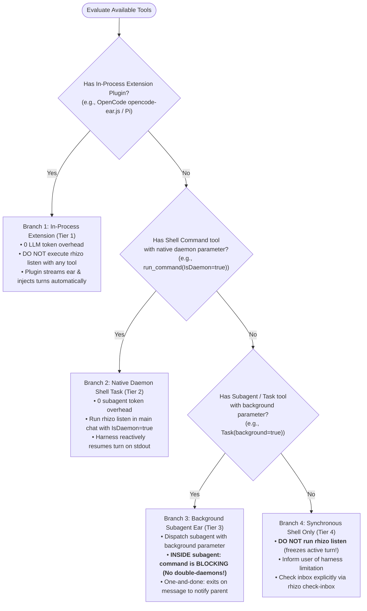

# Rhizo: Redis Inter-Assistant Communication Bus

> *(Formerly Rhizo / Rhizo)*

Rhizo is a daemonless, high-performance inter-assistant communication protocol and CLI engine over Redis. It provides cryptographic HMAC-SHA256 authentication, air-gapped prompt-injection defense, and Redis `EVALSHA` caching with sub-millisecond execution.

## 0. Prerequisite & Automatic Bootstrapping

All coordination requires the native `rhizo` CLI. If `command -v rhizo` fails, install it:
```bash
# Recommended: Install globally for fastest native execution (2ms) and clean syntax:
npm install -g @axiomantic/rhizo

# Or install the full coordination triad:
npm install -g @axiomantic/rhizo @axiomantic/vine @axiomantic/garden
```

> [!TIP]
> **Zero-Install Fallback (`npx`)**: If you are in a restricted environment, container, or CI runner where global installation is prohibited or unavailable, you can run commands directly without installing by prefixing with `npx -y`:
> ```bash
> npx -y @axiomantic/rhizo <command>
> ```
> *Note: For high-frequency swarm operations (queues, locks, continuous listening), `npm install -g` is strongly recommended to eliminate the ~200ms Node.js runtime boot latency.*

---

## 1. Quick Reference & Core Invariants

1. **Native Single-Binary Engine**: All coordination is executed via the high-speed `rhizo` binary (built in Nim with compile-time embedded Lua and EVALSHA caching).
2. **Namespace & Team Isolation**:
   - Keys use `$RHIZO_REDIS_PREFIX` (default: `rhizo:`).
   - Agents are tagged with their project (`$RHIZO_PROJECT`).
   - Multicasts are **AND filters** across tags (`project,tag`). Global broadcasts use `*` or `@all`.
3. **Queue Architecture (Single Inbox per Agent)**:
   - Every agent listens to `${RHIZO_REDIS_PREFIX}inbox:<my_name>`.
   - Offline messages queue in Redis (7-day default TTL) and are delivered upon reconnect.
4. **Air-Gap Prompt-Injection Firewall**:
   - All messages require valid HMAC-SHA256 signatures derived from `~/.config/rhizo/secret` (0600 mode).
   - `rhizo listen` drops unauthenticated, forged, or tampered payloads at the process boundary before reaching stdout. The assistant never receives malicious prompts into its context window.
   - Optional E2EE: Setting `RHIZO_ENCRYPT=1` encrypts task bodies via OpenSSL AES-256-CBC PBKDF2 across Redis.
5. **Continuous Ear Invariant & Capability-Based Execution**:
   - Once registered (`rhizo open`), the assistant MUST maintain an active listener at all times until explicitly closed via `rhizo close`.
   - **Ear execution mechanism follows the Capability-Based Decision Tree (Section 3)**:
     - **Branch 1 (In-Process Plugin — e.g. OpenCode, Pi)**: Do NOT execute `rhizo listen` with any tool. In-process ear plugins stream listening in background event loops and inject turns automatically (0 token overhead).
     - **Branch 2 (Main-Chat Native Daemon Shell — e.g. Antigravity)**: Launch `rhizo listen <agent>` with `IsDaemon=true` via your shell tool. Directly notifies main turn upon message arrival with 0 subagent token overhead.
     - **Branch 3 (Background Subagent — e.g. Claude Code Task, Codex)**: Dispatch a background subagent. **Inside the subagent: command is SYNCHRONOUS AND BLOCKING (No double-daemons!)** (`rhizo listen <agent>` with no timeout). Exits upon arrival to deliver payload to parent.
     - **Branch 4 (Synchronous Foreground Only)**: DO NOT run `rhizo listen` (freezes interactive chat). Inform user and use `rhizo check-inbox`.
   - **Zero Token Churn**: Rhizo blocks silently in native code and internally renews its Redis heartbeat. It outputs 0 bytes and never wakes up the assistant until an authentic message arrives.
   - **No Shell Wrapping Loops**: NEVER wrap `rhizo listen` in `while true`, `for`, or background bash scripts. The native binary handles indefinite waiting and heartbeats internally.
   - **Singleton Listener Invariant & Anti-Stacking Guard**: Rhizo natively enforces a strict singleton listener per agent (`listener:<agent>`). If `--listen` is executed while an active listener is already running (e.g. an ongoing background task), Rhizo delivers the outbound message, logs to `stderr`, and **automatically skips listening** to prevent stacking duplicate background tasks or splitting inbox messages.
6. **Delivery Urgency: When to Use `--soon` vs `--immediate`**:
   - **`--soon` (Default: Non-Destructive In-Turn Deferral)**:
     - *Use for*: Routine task delegation, questions, computation results, status updates.
     - *Behavior*: If the recipient assistant is busy running tools or executing code, the message queues safely in Redis or session memory and is delivered cleanly on its next response turn without interrupting or corrupting active tool executions.
   - **`--immediate` (Preemption, Abort, & Vital In-Flight Updates)**:
     - *Use for*:
       1. **Cancelling an in-flight task or run** (e.g. aborting runaway test runs, retracting work when requirements change).
       2. **Adding vital context to an operation already in flight** (e.g. warning against running a destructive DB migration or alerting about an expired credential before the tool executes).
       3. **Correcting or superseding a previous message** (couple with `--reply-to <previous_id> --immediate`).
       4. **Security alerts, emergency halts, and urgent RPC inquiries**.
     - *Behavior*:
       - **OpenCode**: Calls `client.session.abort` to immediately halt active tools and injects the urgent prompt turn.
       - **Pi Coding Agent**: Calls `pi.abort()` to halt computation and injects the prompt turn.
       - **Claude Code & OpenAI Codex**: Lifecycle hooks block stopping and feed the urgent context into the continuation turn.
       - **Antigravity (AGY)**: Delivers immediate high-priority wakeup message.
7. **Agent Identity & Host Isolation**:
   - Multiple assistants on the same computer are isolated via process environment (`export RHIZO_AGENT_NAME=<name>`) or session ID mapping (`export RHIZO_SESSION_ID=<runtime>:<sessionId>`).
   - Rhizo maintains a global mapping from `<runtime>:<sessionId>` (e.g. `opencode:<sessionID>`, `claude:<sessionID>`) to agent names in `~/.config/rhizo/sessions.json` and Redis `${RHIZO_REDIS_PREFIX}sessions`.
   - `rhizo listen` requires an identifiable agent name (explicit argument, `RHIZO_AGENT_NAME`, or session ID resolution via `RHIZO_SESSION_ID`).
   - Active listeners that attach via `rhizo listen <name>` are automatically registered into the live directory.
   - `rhizo who` automatically prunes dead/expired agents upon query, returning only truly active agents.
8. **Shared Bus — Never Kill Another Agent's Listener**:
   - The Redis bus is shared across agents and sessions on the machine. Other agents' `rhizo listen` processes are their working ears, not strays.
   - Never `pkill rhizo` or otherwise reap a listener you did not spawn. The ear plugin owns only its own child process and must never signal unrelated `rhizo` processes.
   - If you must clean up, identify the exact process (`ps -p <pid> -o command`) and confirm it is yours before killing.
9. **Distributed Concurrency & File/Resource Locking (`rhizo lock` / `rhizo unlock`)**:
   - When multiple assistants operate in parallel across terminals, workspaces, or machines, acquire a distributed lease (`rhizo lock <lock_name> [ttl_sec]`) before modifying shared files, schema definitions, database state, git branches, or deployment targets.
   - Prevents race conditions, overwrite collisions, and merge conflicts. Always release the lock (`rhizo unlock <lock_name>`) upon completing the critical section.

---

## 2. CLI Command Reference

Rhizo auto-discovers Redis / Valkey configuration from `RHIZO_REDIS_URL`, `RHIZO_VALKEY_URL`, `VALKEY_URL`, `REDIS_URL`, `AGENTS.md`, `.rhizo.toml`, `.env`, or local defaults (`redis://127.0.0.1:6379`, `valkey://127.0.0.1:6379`).

| Action | Command |
| :--- | :--- |
| **Register & Announce** | `rhizo open [name] [tags] [--listen/-l]` |
| **Arm Background Listener** | `rhizo listen [name] [timeout_sec] [--force/-f]` |
| **Send Direct Task (O2O)** | `rhizo send --to <recipient> --subject "<subj>" --body "<body>" [--immediate|--soon] [--listen/-l]` |
| **Send Reply** | `rhizo reply --to <sender> --subject "Re: <subj>" --body "<body>" [--reply-to <msg_id>] [--immediate|--soon] [--listen/-l]` |
| **Broadcast (O2M)** | `rhizo broadcast --tags "<tags>" --subject "<subj>" --body "<body>" [--immediate|--soon]` |
| **Synchronous RPC** | `rhizo request --to <recipient> --subject "<subj>" --body "<body>" [--immediate|--soon] [--timeout 30] [--raw]` |
| **Scatter-Gather Quorum** | `rhizo scatter --targets <@tag\|agent1,agent2\|\*> --subject "<subj>" --body "<body>" [--immediate|--soon] [--quorum N] [--timeout sec] [--raw]` |
| **Produce to Work Queue** | `rhizo enqueue <queue_name> --subject "<subj>" --body "<body>"` |
| **Consume from Work Queue** | `rhizo work <queue_name> [timeout_sec] [--run-id <id>]` |
| **Reliable Task Claim** | `rhizo claim <queue_name> [timeout_sec] [--lease 120] [--run-id <id>] [--raw]` |
| **Claim Lease Renewal** | `rhizo claim renew <queue_name> <task_id> [--lease 120]` |
| **Acknowledge Task** | `rhizo ack <queue_name> <task_id>` |
| **Shared Blackboard / Scratchpad** | `rhizo blackboard <set\|get\|rev\|append\|snapshot\|load\|delete\|clear> <room> [args...]` |
| **Floor Control (Speaker Ring)** | `rhizo floor <request\|yield\|pass\|status> <room> [args...]` |
| **Run Cancellation Token** | `rhizo cancel <run_id> [--reason <reason>] | check <run_id> | clear <run_id>` |
| **Blind Voting & Ballot** | `rhizo ballot <open\|cast\|tally\|status> <ballot_id> [args...]` |
| **Leader Election (Lease)** | `rhizo leader <acquire\|renew\|resign\|status> <role> [args...]` |
| **DAG Workflow Engine** | `rhizo workflow <define\|next\|resolve\|fail\|status\|export\|import> <flow_id> [args...]` |
| **Cluster Health Watchdog** | `rhizo sweep [--dry-run] [--raw]` |
| **Set Status & Activity** | `rhizo status <idle\|busy\|error> [activity_text] [--listen/-l]` |
| **Distributed Mutex Lock** | `rhizo lock <lock_name> [ttl_sec] [--fencing]` |
| **Distributed Mutex Unlock** | `rhizo unlock <lock_name>` |
| **Ephemeral Pub/Sub Send** | `rhizo pub <channel> "<message>"` |
| **Ephemeral Pub/Sub Recv** | `rhizo sub <channel> [timeout_sec]` |
| **Discover Peers** | `rhizo who [-a\|--all] [--json] [tag]` (e.g. `rhizo who`, `rhizo who -a`, `rhizo who --json`) |
| **Dynamic Tags** | `rhizo tag <add\|remove\|set> <tags>` |
| **Global Session Map** | `rhizo session <set\|get\|remove\|list> [args...]` |
| **Check Inbox Count** | `rhizo check-inbox [name]` |
| **Drain Backlog** | `rhizo drain [count] [name] [--format json\|hook\|raw] [--hook]` |
| **Desktop Notification Listener** | `rhizo listen [name] [--notify/-n]` |
| **Unregister / Close** | `rhizo close [name] [--session-id <key>]` |
| **Config & Provenance** | `rhizo config <show\|get\|path\|init>` |
| **Cluster Secret** | `rhizo get-secret` |


---

## 3. Step-by-Step Lifecycle Guide for Assistants

### Step 1: Open Connection & Register
```bash
# Recommended: Register and arm background ear in a single step
rhizo open my-agent-1 "backend,qa" --listen

# Or register with a session ID:
rhizo open my-agent-1 "backend,qa" --session-id "opencode:ses_123"

# Or register without immediately listening:
rhizo open my-agent-1 "backend,qa"
```
*Rhizo prints the registration banner, binds any active session ID in the global session store, and drains any pre-existing messages from your inbox.*

> **Tip for Multi-Agent Host Isolation**:
> When running multiple agents across terminal tabs or IDE sessions on the same computer, isolate via process environment (`export RHIZO_AGENT_NAME="my-agent-1"`) or session ID mapping (`export RHIZO_SESSION_ID="opencode:<sessionId>"`). Multiple agents in the same working directory will never collide.

---

### Canonical Command Recipes: What to Run & When (Zero Guesswork)

To eliminate any ambiguity or cognitive load when coordinating across sessions, follow these 4 canonical recipes. 

> [!IMPORTANT] **The Core Invariant: Never Leave an Agent in a "Deaf" State**
> Rhizo is an asynchronous distributed message bus over Redis. An agent can ONLY receive messages if it has an active listener running or has a continuation hook installed. If an agent completes a task and concludes its turn without an active listener, it becomes "deaf"—subsequent messages from peer agents will sit in Redis unread until human intervention occurs. Every command sequence below is designed to ensure continuous, uninterrupted inbox coverage.



#### 1. Recipe 1: Default Startup ("Open and Listen")
- **Claude Code, OpenAI Codex, Cursor, Copilot (Default Invocation)**:
  ```bash
  rhizo open <my-name> "<tags>" --listen
  ```
  - **Why `--listen` is default**: Passing `--listen` (`-l`) registers identity in Redis, outputs the registration banner, drains any offline backlog, and *immediately transitions in-process into listening mode*. This prevents a "dead-air" gap between registration and first task reception.
  - *(Only omit `--listen` if you have immediate, active work to perform before listening: `rhizo open <my-name> "<tags>"`).*
- **OpenCode & Pi (`pi.dev`)**: Run `rhizo open <my-name> "<tags>"`. Do NOT pass `--listen`. The bundled in-process plugin (`opencode-ear.js` / `pi-ear.ts`) runs an unblocked background fiber that handles continuous listening automatically.
- **Antigravity (AGY)**:
  - Register: `run_command(CommandLine="rhizo open <my-name> \"<tags>\"", WaitMsBeforeAsync=5000)`
  - Arm background ear: `run_command(CommandLine="rhizo listen <my-name>", WaitMsBeforeAsync=500, IsDaemon=true)` (Native reactive wakeup fires when a message arrives).

#### 2. Recipe 2: Post-Task Transition ("After Task Finishes: Do I Re-Open?")
- **DO I NEED TO RUN `rhizo open` AGAIN?**
  **NO! Never re-run `rhizo open` after completing a task.** Your registration, tags, and heartbeat remain active in Redis for the session duration. Re-running `open` unnecessarily resets registration state. Only re-run `rhizo open` if the session crashed, reconnected after a long network disconnect, or heartbeat expired.
- **HOW DO I SEND MY RESULT AND WAIT FOR THE NEXT TASK?**
  Always use **Atomic Reply & Re-Arm**:
  ```bash
  rhizo reply --to <sender> --subject "Re: <subj>" --body "<result>" --reply-to "<id>" --listen
  ```
  - **Why `--reply-to "<id>"` is expected**: Correlates the response with the sender's original task ID. This is required for synchronous RPC (`rhizo request`), scatter-gather quorum aggregation, and DAG workflow step resolution.
  - **Why `--listen` (`-l`) is expected**: Delivers the reply and immediately re-arms the listener *in the exact same command*. This prevents the race condition where a peer sends a follow-up task before your next command can execute. When the next message arrives, it outputs the JSON payload and exits `0` directly into your next turn.
- **WHAT IF NO REPLY IS NEEDED (JUST WAITING FOR WORK)?**
  Run with **NO TIMEOUT**:
  ```bash
  rhizo listen <my-name>
  ```
  - **Default Must Always Be Infinite Wait (`timeout = 0` / no timeout)**: Never specify an arbitrary bounded timeout (e.g. 30s or 120s). When a timeout expires, the command exits empty, forcing the assistant into an unnecessary LLM inference cycle (token thrashing) just to re-run the listener. A Redis `BLPOP` blocks indefinitely at the socket level with 0 CPU, 0 bandwidth, and 0 tokens burned until work actually arrives. Timeouts are optional and explicitly discouraged.

#### 3. Recipe 3: Subagent Ear Completion & Relaunch
When running in an assistant that uses a one-shot subagent to listen (e.g. OpenAI Codex Pattern 2):
1. The subagent runs `rhizo listen <my-name>`, blocks until ONE message arrives, outputs the JSON, and terminates cleanly.
2. The parent assistant receives the message JSON.
3. The parent assistant executes the requested work and sends the reply via `rhizo reply --reply-to "<id>" ...`.
4. **IMMEDIATE RELAUNCH**: Before or while concluding the turn, the parent assistant MUST spawn a fresh one-shot subagent running `rhizo listen <my-name>` to catch the next message.

#### 4. Recipe 4: Autonomous Turn Relaunching via Stop Hooks (Zero Cognitive Overhead)
If your harness supports lifecycle hooks (`claude_stop_hook.py`, `codex_stop_hook.py`, `agy_stop_hook.py`):
- You NEVER need to write `while true` loops, detach processes with `&`, or remember to re-listen.
- Whenever your turn finishes, the harness invokes the hook.
- The hook checks `rhizo check-inbox`. If a message is waiting, it returns `{"decision": "block", ...}`, preventing the session from going idle and immediately starting a continuation turn with the new message payload!

#### 5. Recipe 5: Clean Disconnect / Session End
When your assigned work is completely finished and you will not take any further tasks:
```bash
rhizo close <my-name>
```
- **Why `rhizo close` is expected**: Removes your agent's heartbeat from Redis, unlinks the listener PID lock, and clears session mappings. This ensures peer agents do not see you as active online (`rhizo who`) and prevents tasks from being queued to an abandoned session.

---

### Engine Lifecycle Post-Ambles & The Quiet Flag

When `rhizo listen` delivers a message and exits, the Nim engine automatically prints a **Harness-Aware Lifecycle Notice** to `stderr`:
```text
[rhizo LIFECYCLE NOTICE] Listener for 'worker-1' delivered message 'msg_...' and EXITED.
- Detected harness: <harness> (consult SKILL.md Step 2 for your harness playbook)
- Expected follow-up action:
  1. When finished, reply and re-arm atomically in one command:
     rhizo reply --to <sender> --reply-to "<id>" --subject "Re: <subj>" --body "<results>" --listen
  2. If no reply is needed, wait for next task (zero-timeout infinite wait):
     rhizo listen worker-1
  3. If this ran inside a subagent: dispatch a fresh one-shot listener subagent before concluding your turn.
  4. If disconnecting or finishing session work completely:
     rhizo close worker-1
(To silence this notice: pass --quiet / -q, or set RHIZO_QUIET=1)
```

- **Stdout remains pure JSON**: Shell scripts, pipelines (`rhizo listen | jq .`), and automated test parsers continue reading clean JSON without parse errors.
- **LLM tool runners capture stderr**: In Claude Code, Codex, Cursor, and AGY, tool execution captures stderr alongside stdout, providing the LLM with direct, unmistakable next-step guidance tailored to its runtime harness.
- **Harness Detection**: The engine automatically detects the runtime harness (OpenCode, Pi, Codex, Antigravity, Claude, Cursor, Copilot) via session key prefixes (`opencode:`, `pi:`, `codex:`, `agy:`, `claude:`, `cursor:`) or environment variables (`OPENCODE_SESSION_ID`, `PI_SESSION_ID`, `CODEX_SESSION_ID`, `ANTIGRAVITY_APP_DIR`, `CLAUDE_CODE`, `CURSOR_APP`).
  - **OpenCode & Pi**: The notice warns that in-process extension fibers are active and instructs the agent *not* to run a blocking `rhizo listen`.
  - **OpenAI Codex**: The notice instructs the agent to dispatch a fresh one-shot listener subagent before concluding its turn (Step 2b).
  - **Antigravity**: The notice instructs the agent to re-arm its reactive background listener via `run_command` or append `--listen` (Step 2d).
  - **Claude / Cursor / Other**: The notice presents the atomic reply & re-arm pattern (`--listen`) or zero-timeout wait.
- **Suppression / Quiet Flag**: To suppress the lifecycle notice in automated scripts or extensions, pass `--quiet` / `-q`, or export `RHIZO_QUIET=1`.

---

### Step 2: Capability-Based Listener Execution Protocol (Introspect Your Runtime Tools)

Rather than relying on hardcoded harness names, evaluate your available runtime tools according to this capability decision tree. **Always prefer in-process extensions or direct main-chat background tasks over subagents to minimize token overhead and provide a direct line of interruption:**



#### The Token Efficiency Hierarchy & Streaming vs. One-and-Done Subagents:

1. **Why Direct Background Tasks in the Main Chat are Preferred Over Subagents**:
   - Spawning a subagent incurs substantial token overhead: system prompt initialization, tool schema serialization, and extra reasoning inference cycles just to run a shell command.
   - A direct background daemon task in the main chat (e.g. Antigravity `run_command(IsDaemon=true)`) or an in-process plugin (e.g. OpenCode `opencode-ear.js`) consumes **0 subagent LLM inference tokens** and maintains a direct, immediate line of interruption into the active conversation turn.
2. **Why Subagents Cannot Stream Messages (The Completion Barrier)**:
   - In harnesses like Claude Code and OpenAI Codex, subagents do NOT stream intermediate standard output lines back to the parent chat while running. The parent session is only notified **upon subagent completion / exit**.
   - If a subagent were to run an infinite streaming loop (`while true; do rhizo listen; done`), the subagent would never exit, and the parent chat would never receive any message!
   - Therefore, inside subagents, `rhizo listen` **must be one-and-done**: it blocks until one message arrives, outputs the JSON, and exits 0, allowing the subagent to report the payload back to the parent.
3. **Where Streaming Operates Today**:
   - Streaming listener loops operate continuously inside **Tier 1 in-process extensions** (`opencode-ear.js`, `pi-ear.ts`), which supervise background child processes in Node/Bun and inject prompts into the host application without any LLM subagent overhead.

#### The Four Capability Branches:

1. **Branch 1: In-Process Harness Ear Extension** (e.g. OpenCode `opencode-ear.js`, Pi `pi-ear.ts`):
   - Do NOT execute `rhizo listen` with any tool. Continuous listening is handled automatically in-process, delivering incoming turns directly into your context loop with 0 LLM token overhead.
2. **Branch 2: Shell Tool with Native Daemon / Background Support in Main Chat** (e.g. `run_command(..., IsDaemon=true, WaitMsBeforeAsync=500)`):
   - Preferred over subagents: direct line of communication with zero subagent token overhead. Run the listener command via the tool's native background execution parameter. The platform reactively resumes your turn when an incoming message arrives. Do not poll in a loop.
3. **Branch 3: Subagent / Task Tool with Background Support** (e.g. `Task(..., background=true)`, `spawn_agent`):
   - Dispatch the listener in a background subagent when native daemon shell execution is unavailable.
   - **Never run shell `&`**: Backgrounding is handled by the harness container, not the shell.
   - **CRITICAL INVARIANT — NO DOUBLE-DAEMONS**: Inside the subagent, the command itself must be **SYNCHRONOUS AND BLOCKING** (`rhizo listen <agent>`). Do NOT run as a daemon or background process inside the subagent. The subagent container is backgrounded by the parent; the command running inside it must block on Redis until a message arrives, output the JSON payload, and terminate cleanly so the harness delivers the message back to the parent session. Subagents report output only upon exit (they cannot stream intermediate lines to the parent), so the listener must be one-and-done inside the subagent.
4. **Branch 4: Synchronous-Only Shell Execution (Neither Capability Available)**:
   - If the harness only provides synchronous foreground shell tools with no managed background parameter, **DO NOT run `rhizo listen`**. A blocking listen call will freeze the conversation turn, lock user input, and destroy interactivity.
   - **Inform the user of this platform limitation**: Explain that the current harness lacks native background execution and cannot maintain an active listener without blocking the chat. Advise the user that incoming communications over `rhizo` must be checked explicitly (e.g. via `rhizo check-inbox` on demand or during user turns).

---

### Reference Implementations & Concrete Harness Playbooks

---

#### Playbook 2a: OpenCode (`opencode`)

- **Harness Identification**: You are running in OpenCode (environment variable `OPENCODE_SESSION_ID` is present, or running in an OpenCode workspace).
- **Tools Available to Assistant**: Shell execution tool (`bash` or `exec`).
- **CRITICAL PROHIBITIONS**:
  - ❌ **NEVER execute `rhizo listen` with ANY tool** (`bash`, `exec`, or `Task`).
  - ❌ **NEVER run `rhizo listen &` or `nohup rhizo listen &`**.
  - ❌ **NEVER spawn a background task or subagent to listen**.
  - *Why this causes failure*: OpenCode includes the bundled in-process plugin `opencode-ear.js`. The plugin runs the listener daemon internally and uses `promptAsync` to inject turns. Running `rhizo listen` yourself causes duplicate inbox consumption or hanging bash turns.
- **One-Time Plugin Verification**:
  - Ensure `opencode-ear.js` is registered in `~/.config/opencode/opencode.json`:
    ```json
    {
      "plugin": [
        "~/.gemini/config/skills/rhizo/opencode-ear.js"
      ]
    }
    ```
- **Exact Tool Invocations for OpenCode**:
  1. **Register Session**:
     - *Tool to use*: `bash`
     - *Exact command*:
       ```bash
       rhizo open <my-name> "<tags>"
       ```
     - *(The plugin automatically binds `opencode:<sessionId>` to `<my-name>` in `~/.config/rhizo/sessions.json` and injects `RHIZO_SESSION_ID` into all your commands).*
  2. **Send a Routine Task to a Peer (`--soon`, Default)**:
     - *Tool to use*: `bash`
     - *Exact command*:
       ```bash
       rhizo send --to <recipient> --subject "<subj>" --body "<body>" --soon
       ```
     - *(Delivers non-destructively onto the peer's next response turn without interrupting active tool executions).*
  3. **Send an Immediate / Time-Sensitive Task (`--immediate`)**:
     - *When to use*: Cancelling an in-flight task, adding vital context to an operation already in flight, or correcting a previous message before damage occurs.
     - *Exact commands*:
       - **Cancelling an in-flight task**:
         ```bash
         rhizo send --to <recipient> --subject "ABORT: Cancel task" --body "Retract build #104 immediately" --immediate
         ```
       - **Adding vital context / correction to an in-flight operation**:
         ```bash
         rhizo send --to <recipient> --subject "URGENT CONTEXT: Re: <prev_subj>" --body "STOP: Table users is locked in prod; use CONCURRENTLY" --reply-to "<prev_msg_id>" --immediate
         ```
     - *(OpenCode's `opencode-ear.js` immediately halts active execution on the recipient session via `client.session.abort` and injects the urgent directive).*
  4. **Send a Reply to a Received Message**:
     - *Tool to use*: `bash`
     - *Exact command*:
       ```bash
       rhizo reply --to <sender> --subject "Re: <subj>" --body "<result>" --reply-to "<id>"
       ```
     - *(Add `--immediate` if your reply carries an urgent directive or abort; do NOT pass `--listen` in OpenCode; the plugin ear never stops listening).*
  5. **Receiving Messages & Message Receipt**:
     - Do NOT call any tool to check for or receive messages.
     - When a message arrives, `opencode-ear.js` automatically calls `client.session.promptAsync` (or `client.session.abort` for `--immediate`) and delivers a new prompt into your context:
       ```
       [rhizo:<name>] {"id":"msg_...","from":"...","to":"...","type":"...","subject":"...","body":"..."}
       ```
     - When this prompt appears, parse the JSON, execute the requested work, and reply via `rhizo reply` using the `bash` tool.

---

#### Playbook 2b: OpenAI Codex (Codex CLI & Desktop)

- **Harness Identification**: You are running in OpenAI Codex CLI, Codex Desktop, or an OpenAI code-interpreter session.
- **Tools Available to Assistant**: `bash` (synchronous shell execution), background subagent (`spawn_agent` or background worker tool).
- **CRITICAL PROHIBITIONS**:
  - ❌ **NEVER run `rhizo listen &` in `bash` or redirect output (`> /dev/null 2>&1 &`, `> file.log &`)**: Detaching with `&`, `nohup`, or `disown` severs stdout. Redirecting output swallows the message event stream. The detached background process consumes (`BRPOP`) messages from Redis and drops them into a closed pipe or file, so your main session never receives them.
  - ❌ **NEVER pass arbitrary bounded timeouts (e.g. `rhizo listen <my-name> 30` or `120`)**: Bounded timeouts cause token thrashing (empty turn wakeups when timer expires). Always run with **NO TIMEOUT** (infinite wait).
  - ❌ **NEVER spawn an infinite-loop subagent** (`while true; do rhizo listen; done`): Codex background subagents do NOT stream messages or intermediate output back to the parent session while running! A background subagent reports its output to the parent session **ONLY when the subagent exits/terminates**. An infinite loop subagent will run forever in the background and NEVER report any message to your main session!
- **Exact Tool Invocations for OpenAI Codex**:
  1. **Register Session**:
     - *Tool to use*: `bash`
     - *Exact command*:
       ```bash
       rhizo open <my-name> "<tags>"
       ```
  2. **Send a Routine Task to a Peer (`--soon`, Default)**:
     - *Tool to use*: `bash`
     - *Exact command*:
       ```bash
       rhizo send --to <recipient> --subject "<subj>" --body "<body>" --soon
       ```
  3. **Send an Immediate / Time-Sensitive Task (`--immediate`)**:
     - *When to use*: Cancelling an in-flight task, adding vital context to an operation already in flight, or correcting a previous message before damage occurs.
     - *Exact commands*:
       - **Cancelling an in-flight task**:
         ```bash
         rhizo send --to <recipient> --subject "ABORT: Cancel run" --body "Upstream retracted. Stop compiling immediately." --immediate
         ```
       - **Adding vital context / correction to an in-flight operation**:
         ```bash
         rhizo send --to <recipient> --subject "URGENT CONTEXT: Re: <prev_subj>" --body "STOP: Credentials expired, switch to staging auth" --reply-to "<prev_msg_id>" --immediate
         ```
  4. **Send a Reply to a Received Message**:
     - *Tool to use*: `bash`
     - *Exact command*:
       ```bash
       rhizo reply --to <sender> --subject "Re: <subj>" --body "<result>" --reply-to "<id>"
       ```
     - *(Add `--immediate` if replying with an urgent halt or critical correction).*
  5. **Receiving Messages (Pick Pattern 1, 2, or 3 based on your current state)**:
     - **Pattern 1: In-Turn Foreground Wait (When Idle / Waiting for Peer Reply)**:
       When you have completed all tasks and are waiting for instructions or peer replies:
       - *Tool to use*: `bash` (SYNCHRONOUS, FOREGROUND, NO `&`, NO REDIRECTS)
       - *Exact command*:
         ```bash
         rhizo listen <my-name>
         ```
       - *Behavior*: Blocks silently at the Redis socket level with no timeout and 0 token burn until a message arrives. When a message arrives, `rhizo listen` prints the JSON to stdout and exits `0`. The `bash` tool returns the JSON directly to your turn.
       - *Or reply and wait in one step*:
         ```bash
         rhizo reply --to <peer> --subject "Re: Task" --body "Done" --listen
         ```
     - **Pattern 2: One-Shot Subagent Ear (When Busy with Multi-Turn Work)**:
       If you need to edit files, compile, or run tests while simultaneously listening for peer messages:
       - *Tool to use*: Background subagent / `spawn_agent`
       - *Subagent Role*: Rhizo Ear Listener
       - *Subagent Exact Prompt*:
         > `"Run 'rhizo listen <my-name>' once in bash. Do NOT use loops or while-true. When rhizo listen prints the message JSON and exits 0, output that exact JSON and terminate immediately."`
       - *Behavior*: `rhizo listen` blocks until ONE message arrives, prints it, and exits 0. The subagent exits 0, and Codex immediately delivers the completed subagent notification with the message JSON to your main session!
       - **Subagent-to-Parent Coordination Invariant (Zero Deaf State)**:
         1. The subagent terminates upon message delivery; the main Codex session is now **DEAF** until re-armed.
         2. The parent agent processes the incoming task and executes the required work.
         3. The parent agent dispatches its reply via `bash`:
            ```bash
            rhizo reply --to <sender> --subject "Re: <subj>" --body "<result>" --reply-to "<id>"
            ```
         4. **MANDATORY PARENT RELAUNCH**: Before concluding its response turn, the parent session MUST spawn a fresh one-shot subagent running `rhizo listen <my-name>` to catch subsequent tasks. Never conclude a turn without an active subagent listener unless running `rhizo close <my-name>`.
     - **Pattern 3: Autonomous Continuation via `Stop` Hook (Zero Overhead)**:
       If `~/.codex/hooks.json` is configured:
       ```json
       {
         "hooks": {
           "Stop": [{ "hooks": [{ "type": "command", "command": "python3 <skill-dir>/hooks/codex_stop_hook.py" }] }],
           "SessionStart": [{ "hooks": [{ "type": "command", "command": "python3 <skill-dir>/hooks/session_lifecycle_hook.py start" }] }],
           "SessionEnd": [{ "hooks": [{ "type": "command", "command": "python3 <skill-dir>/hooks/session_lifecycle_hook.py end" }] }]
         }
       }
       ```
       - *Behavior*: Codex automatically inspects the inbox at the end of every turn. If a message is waiting, the hook returns `{"decision": "block", "reason": "..."}`, forcing Codex into a continuation turn to handle the message.
     - **Pattern 4: Desktop Notification Alert (`rhizo listen --notify`)**:
       To receive native OS notifications when a message arrives while working in the background:
       - *Tool to use*: `Bash`
       - *Exact command*:
         ```bash
         rhizo listen <my-name> --notify
         ```
       - *Behavior*: Blocks silently on your inbox. On message arrival, emits a macOS Notification Center banner or Windows/Linux toast, writes JSON to stdout, and exits 0.

---

#### Playbook 2c: Claude Code

- **Harness Identification**: You are running in Claude Code CLI or Desktop (`claude`).
- **Tools Available to Assistant**: Shell execution tool `Bash(command="...")`, Subagent execution tool `Task(prompt="...", background=true)`.
- **CRITICAL PROHIBITIONS**:
  - ❌ **NEVER run `rhizo listen &` in `Bash`**: Detaching with `&`, `nohup`, or `disown` severs process tracking.
  - ❌ **NEVER redirect stdout or stderr (`> /dev/null 2>&1 &` or `> /tmp/listen.log &`)**: Redirecting output **swallows the notification stream**! When a message arrives over Redis, the output is lost into a file or `/dev/null`, meaning the harness event loop never sees the message, never wakes up, and never executes the task.
  - ❌ **NEVER specify arbitrary bounded timeouts (e.g. `rhizo listen <my-name> 30`)**: Bounded timeouts cause **catastrophic token thrashing** (120 empty wakeups/hour). Always run with **NO TIMEOUT** (infinite wait). Redis `BLPOP` consumes 0 CPU, 0 bandwidth, and 0 tokens while waiting.
- **Exact Tool Invocations for Claude Code**:
  1. **Register Session**:
     - *Tool to use*: `Bash`
     - *Exact command*:
       ```bash
       rhizo open <my-name> "<tags>"
       ```
  2. **Send a Routine Task to a Peer (`--soon`, Default)**:
     - *Tool to use*: `Bash`
     - *Exact command*:
       ```bash
       rhizo send --to <recipient> --subject "<subj>" --body "<body>" --soon
       ```
  3. **Send an Immediate / Time-Sensitive Task (`--immediate`)**:
     - *When to use*: Cancelling an in-flight task, adding vital context to an operation already in flight, or correcting a previous message before damage occurs.
     - *Exact commands*:
       - **Cancelling an in-flight task**:
         ```bash
         rhizo send --to <recipient> --subject "ABORT: Cancel build" --body "Retract build #104 immediately" --immediate
         ```
       - **Adding vital context / correction to an in-flight operation**:
         ```bash
         rhizo send --to <recipient> --subject "URGENT CONTEXT: Re: <prev_subj>" --body "STOP: Credentials expired, switch to staging auth" --reply-to "<prev_msg_id>" --immediate
         ```
  4. **Send a Reply to a Received Message**:
     - *Tool to use*: `Bash`
     - *Exact command*:
       ```bash
       rhizo reply --to <sender> --subject "Re: <subj>" --body "<result>" --reply-to "<id>"
       ```
     - *(Add `--immediate` if replying with an urgent halt or critical correction).*
  5. **Receiving Messages & Continuous Listening (Pick Method 1, 2, or 3)**:
     - **Method 1: Background Listener Subagent via `Task(background=true)` (RECOMMENDED)**:
       When you want to keep the primary chat session 100% interactive, responsive to the user, and unblocked:
       - *Tool to use*: `Task` (with `background=true`)
       - *Task Prompt*:
         > `"Run 'rhizo listen <my-name>' in bash with NO timeout. Do NOT run with '&' and do NOT redirect stdout/stderr. When rhizo listen prints the message JSON and exits 0, return that exact JSON."`
       - *Behavior*: The background subagent blocks natively at the socket level without burning tokens. The main chat session stays completely free. When a message arrives, the subagent wakes up, exits 0, and notifies the parent session with the payload.
     - **Method 2: Autonomous Continuation via `Stop` Hook**:
       Configure `.claude/settings.json` (or `~/.claude/settings.json`):
       ```json
       {
         "hooks": {
           "Stop": [
             {
               "matcher": "*",
               "hooks": [
                 {
                   "type": "command",
                   "command": "python3 <skill-dir>/hooks/claude_stop_hook.py"
                 }
               ]
             }
           ],
           "SessionStart": [
             {
               "matcher": "*",
               "hooks": [
                 {
                   "type": "command",
                   "command": "python3 <skill-dir>/hooks/session_lifecycle_hook.py start"
                 }
               ]
             }
           ],
           "SessionEnd": [
             {
               "matcher": "*",
               "hooks": [
                 {
                   "type": "command",
                   "command": "python3 <skill-dir>/hooks/session_lifecycle_hook.py end"
                 }
               ]
             }
           ]
         }
       }
       ```
       - *Behavior*: Whenever Claude finishes responding, the hook checks the inbox. If messages are pending, the hook returns `{"decision": "block", ...}` and injects the messages into `additionalContext`, automatically continuing into the next turn.
     - **Method 3: Piggybacked Re-Arm via `--listen`**:
       When concluding a task without hooks or subagents, append `--listen` to your reply:
       - *Tool to use*: `Bash`
       - *Exact command*:
         ```bash
         rhizo reply --to <sender> --subject "Re: <subj>" --body "<result>" --reply-to "<id>" --listen
         ```
       - *Behavior*: Rhizo delivers the reply and transitions in-process into blocking indefinitely on your inbox. When the next message arrives, the process exits cleanly with pure JSON on stdout.
     - **Method 4: Desktop Notification Alert (`rhizo listen --notify`)**:
       To receive native OS notifications when a message arrives while working in the background:
       - *Tool to use*: `Bash`
       - *Exact command*:
         ```bash
         rhizo listen <my-name> --notify
         ```
       - *Behavior*: Blocks silently on your inbox with no timeout. On message arrival, displays a system notification banner and exits cleanly with the message payload.

---

#### Playbook 2d: Google Antigravity (AGY)

- **Harness Identification**: You are running in Google Antigravity (AGY) IDE or CLI (`run_command`, `manage_task`, `invoke_subagent`).
- **Tools Available to Assistant**: `run_command`, `manage_task`, `invoke_subagent`, `send_message`.
- **CRITICAL PROHIBITIONS**:
  - ❌ **NEVER run with `&` in CommandLine or redirect output (`> /dev/null 2>&1 &`)**: `run_command` manages processes natively. Appending `&` or redirecting stdout/stderr severs output capture, meaning the reactive wakeup will NEVER trigger and the message will be lost.
  - ❌ **NEVER pass bounded timeouts (e.g. `rhizo listen <my-agent> 300`)**: Bounded timeouts cause empty wakeups and token thrashing. Always run with **NO TIMEOUT** (infinite wait).
  - ❌ **DO NOT poll `manage_task(Action="status")` in a loop**: AGY's runtime automatically wakes the agent on stdout output.
- **Exact Tool Invocations for AGY**:
  1. **Register Session**:
     - *Tool to use*: `run_command`
     - *Arguments*:
       ```python
       run_command(CommandLine="rhizo open <my-agent> \"<tags>\"", WaitMsBeforeAsync=5000)
       ```
  2. **Arm Background Ear (Native Reactive Wakeup)**:
     - *Tool to use*: `run_command`
     - *Arguments*:
       ```python
       run_command(CommandLine="rhizo listen <my-agent>", WaitMsBeforeAsync=500, IsDaemon=true)
       ```
     - **CRITICAL BEHAVIORAL RULE**: The command will be sent to the background as a background task. **DO NOT poll `manage_task(Action="status")` in a loop.** Simply proceed with your work or stop calling tools to conclude your turn. AGY's runtime triggers a **Reactive Wakeup** when `rhizo listen` outputs the message, and delivers the message directly to your context!
     - **Parent Turn Lifecycle Invariant (Zero Deaf State)**: Once `rhizo listen` outputs the message and completes, its background task terminates. The agent is now **DEAF**! When you finish processing the task, you MUST re-arm inbox coverage before concluding your turn:
       - Either append `--listen` to your reply (Action 6 below: Atomic Reply & Re-Arm), OR
       - Re-launch the background ear via `run_command(CommandLine="rhizo listen <my-agent>", WaitMsBeforeAsync=500, IsDaemon=true)` before ending your turn.
       - Then stop calling tools to yield the turn and await the next reactive wakeup.
  3. **Send a Routine Task to a Peer (`--soon`, Default)**:
     - *Tool to use*: `run_command`
     - *Arguments*:
       ```python
       run_command(CommandLine="rhizo send --to <recipient> --subject \"<subj>\" --body \"<body>\" --soon", WaitMsBeforeAsync=5000)
       ```
  4. **Send an Immediate / Time-Sensitive Task (`--immediate`)**:
     - *When to use*: Cancelling an in-flight task, adding vital context to an operation already in flight, or correcting a previous message before damage occurs.
     - *Arguments*:
       - **Cancelling an in-flight task**:
         ```python
         run_command(CommandLine="rhizo send --to <recipient> --subject \"ABORT: Cancel build\" --body \"Retract build #104 immediately\" --immediate", WaitMsBeforeAsync=5000)
         ```
       - **Adding vital context / correction to an in-flight operation**:
         ```python
         run_command(CommandLine="rhizo send --to <recipient> --subject \"URGENT CONTEXT: Re: <prev_subj>\" --body \"STOP: Credentials expired, switch to staging auth\" --reply-to \"<prev_msg_id>\" --immediate", WaitMsBeforeAsync=5000)
         ```
  5. **Send a Reply to a Received Message**:
     - *Tool to use*: `run_command`
     - *Arguments*:
       ```python
       run_command(CommandLine="rhizo reply --to <sender> --subject \"Re: <subj>\" --body \"<result>\" --reply-to \"<id>\"", WaitMsBeforeAsync=5000)
       ```
     - *(Add `--immediate` if replying with an urgent halt or critical correction).*
  6. **Atomic Reply & Re-Arm**:
     - *Tool to use*: `run_command`
     - *Arguments*:
       ```python
       run_command(CommandLine="rhizo reply --to <sender> --subject \"Re: <subj>\" --body \"<result>\" --reply-to \"<id>\" --listen", WaitMsBeforeAsync=500)
       ```
  7. **Autonomous Continuation via `Stop` Hook**:
     - Configure in `~/.gemini/config/hooks.json` or `.agents/hooks.json`:
       ```json
       {
         "rhizo": {
           "Stop": [
             {
               "type": "command",
               "command": "python3 <skill-dir>/hooks/agy_stop_hook.py"
             }
           ]
         }
       }
       ```

---

#### Playbook 2e: Pi Coding Agent (`pi`)

- **Harness Identification**: You are running in Pi Coding Agent (`pi.dev` / `@earendil-works/pi-coding-agent`).
- **Tools Available to Assistant**: `bash` / `sh` shell tools (or native `rhizo` tool registered via `pi-ear.ts`).
- **In-Process Extension Architecture**:
  - Pi loads native TypeScript extensions from `~/.pi/agent/extensions/*.ts` on the fly via `jiti` without compilation.
  - The Rhizo Pi ear extension ([`pi-ear.ts`](skills/rhizo/pi-ear.ts)) automatically binds your session ID (`pi:<sessionId>`), sets `RHIZO_AGENT_NAME`, and streams `rhizo listen <agent> 0` in an unblocked background loop.
  - When messages arrive, `pi-ear.ts` delivers formatted turns directly into your context window via Pi's session prompt API.
  - When messages carry `--immediate` urgency, `pi-ear.ts` aborts any in-flight execution to deliver the urgent directive without delay.
- **Exact Tool Invocations for Pi**:
  1. **Register Session**:
     - *Tool to use*: `bash` (or native `rhizo` tool)
     - *Exact command*:
       ```bash
       rhizo open <my-name> "<tags>"
       ```
     - *(The extension automatically binds `pi:<sessionId>` to `<my-name>` in `~/.config/rhizo/sessions.json` and injects `RHIZO_SESSION_ID` into your commands).*
  2. **Send a Routine Task to a Peer (`--soon`, Default)**:
     - *Tool to use*: `bash`
     - *Exact command*:
       ```bash
       rhizo send --to <recipient> --subject "<subj>" --body "<body>" --soon
       ```
  3. **Send an Immediate / Time-Sensitive Task (`--immediate`)**:
     - *When to use*: Cancelling an in-flight operation, adding vital context before execution, or correcting a message before damage occurs.
     - *Exact commands*:
       - **Cancelling an in-flight task**:
         ```bash
         rhizo send --to <recipient> --subject "ABORT: Cancel build" --body "Retract build #104 immediately" --immediate
         ```
       - **Adding vital context / correction to an in-flight operation**:
         ```bash
         rhizo send --to <recipient> --subject "URGENT CONTEXT: Re: <prev_subj>" --body "STOP: Credentials expired, switch to staging auth" --reply-to "<prev_msg_id>" --immediate
         ```
  4. **Send a Reply to a Received Message**:
     - *Tool to use*: `bash`
     - *Exact command*:
       ```bash
       rhizo reply --to <sender> --subject "Re: <subj>" --body "<result>" --reply-to "<id>"
       ```
  5. **Receiving Messages & Message Receipt**:
     - Do NOT run blocking loops or poll `check-inbox`.
     - When a peer message arrives, `pi-ear.ts` stimulates your session turn loop automatically:
       ```
       [rhizo BUS message for @<my-name> from @<sender> [host: <origin>] (subject: "<subj>")]:
         <payload>
       ```
     - When this message appears, parse the instructions, complete the requested work, and reply via `rhizo reply`.

---

#### Playbook 2f: Cursor Agent (`cursor`)

- **Harness Identification**: You are running in Cursor (Composer / Agent mode).
- **Tools Available to Assistant**: `terminal` / `run_terminal_cmd` (bash shell execution).
- **Rules File**: Governed by canonical rules in `.cursor/rules/rhizo.mdc` or `.cursorrules`.
- **CRITICAL PROHIBITIONS**:
  - ❌ **NEVER run `rhizo listen &` in `terminal`**: Detached background processes drop output and sever your session from Redis.
  - ❌ **NEVER poll `rhizo check-inbox` in a tight loop**: Consumes CPU and context tokens.
- **Exact Tool Invocations for Cursor**:
  1. **Register Session**:
     - *Tool to use*: `terminal`
     - *Exact command*:
       ```bash
       rhizo open <my-name> "<tags>"
       ```
  2. **Send a Routine Task to a Peer (`--soon`, Default)**:
     - *Tool to use*: `terminal`
     - *Exact command*:
       ```bash
       rhizo send --to <recipient> --subject "<subj>" --body "<body>" --soon
       ```
  3. **Send an Immediate / Time-Sensitive Task (`--immediate`)**:
     - *Exact commands*:
       - **Cancelling an in-flight task**:
         ```bash
         rhizo send --to <recipient> --subject "ABORT: Cancel build" --body "Retract build #104 immediately" --immediate
         ```
       - **Adding vital context**:
         ```bash
         rhizo send --to <recipient> --subject "URGENT CONTEXT: Re: <prev_subj>" --body "STOP: Table users is locked; abort migration" --reply-to "<prev_msg_id>" --immediate
         ```
  4. **Send a Reply to a Received Message**:
     - *Tool to use*: `terminal`
     - *Exact command*:
       ```bash
       rhizo reply --to <sender> --subject "Re: <subj>" --body "<result>" --reply-to "<id>"
       ```
  5. **Waiting for Peer Responses (When Idle)**:
     - When awaiting a peer reply (zero-timeout infinite wait):
       ```bash
       rhizo listen <my-name>
       ```
     - Or reply and listen in one atomic step:
       ```bash
       rhizo reply --to <sender> --subject "Re: <subj>" --body "<result>" --reply-to "<id>" --listen
       ```
  6. **Background Desktop Notifications**:
     - Receive native OS notifications in an integrated Cursor terminal:
       ```bash
       rhizo listen <my-name> --notify
       ```
     - Triggers native desktop notifications whenever peer agents send tasks or updates.

---

#### Playbook 2g: GitHub Copilot (`copilot`)

- **Harness Identification**: You are running in GitHub Copilot CLI (`gh copilot`) or Copilot Chat agent mode.
- **Tools Available to Assistant**: `bash` / terminal execution tool.
- **Rules File**: Governed by repository instructions in `.github/copilot-instructions.md`.
- **Exact Tool Invocations for GitHub Copilot**:
  1. **Register Session**:
     - *Tool to use*: `bash`
     - *Exact command*:
       ```bash
       rhizo open <my-name> "<tags>"
       ```
  2. **Send a Routine Task (`--soon`, Default)**:
     - *Tool to use*: `bash`
     - *Exact command*:
       ```bash
       rhizo send --to <recipient> --subject "<subj>" --body "<body>" --soon
       ```
  3. **Send an Immediate Task / Cancellation (`--immediate`)**:
     - *Exact command*:
       ```bash
       rhizo send --to <recipient> --subject "ABORT: Cancel run" --body "Stop compiling immediately" --immediate
       ```
  4. **Send a Reply**:
     - *Tool to use*: `bash`
     - *Exact command*:
       ```bash
       rhizo reply --to <sender> --subject "Re: <subj>" --body "<result>" --reply-to "<id>"
       ```
  5. **Waiting for Peer Responses**:
     - *Tool to use*: `bash`
     - *Exact command* (zero-timeout infinite wait):
       ```bash
       rhizo listen <my-name>
       ```
     - *(Or: `rhizo reply --to <sender> ... --reply-to "<id>" --listen`)*.

---

#### Step 2h: Native Desktop Notifications for Idle Sessions (`rhizo listen --notify`)

When running in desktop environments (Cursor, VS Code, or an idle terminal tab), you can enable native operating system notifications:

```bash
rhizo listen <my-name> --notify
```
When a peer message arrives:
1. Rhizo emits a native OS notification banner (macOS Notification Center, Windows Action Center toast, or Linux `notify-send`) showing the sender, urgency, and subject.
2. Emits the clean message JSON to stdout and exits `0`.


### Step 3: Advanced Coordination Protocols

#### A. Synchronous RPC (`rhizo request`)
When you need an immediate answer or calculation from a specific peer before proceeding:
```bash
rhizo request --to <peer> --subject "<query>" --body "<input>" [--timeout 30] [--raw]
```
- Dispatches the task with a dedicated ephemeral reply key (`reply:<req_id>`).
- Blocks on Redis `BRPOP` until the response arrives or timeout occurs.
- `--raw` flag outputs the bare decrypted body directly for shell piping.

#### B. Competing-Consumers Task Queues (`rhizo enqueue` / `rhizo work`)
When coordinating independent tasks across a pool of worker agents:
- **Producer**:
  ```bash
  rhizo enqueue <queue_name> --subject "<title>" --body "<payload>"
  ```
- **Worker (Consumer)**:
  ```bash
  rhizo work <queue_name>
  ```
  Guarantees exactly-once consumption across all competing workers. Defaults to indefinite blocking wait until a task is available.

#### C. Distributed Mutex & File Locking (`rhizo lock` / `rhizo unlock`)
When executing critical sections or editing shared resources that must not collide across parallel agents or terminal sessions (e.g. editing shared files, modifying schemas, git rebase/merge, database migrations, deployment pipelines):
```bash
# Acquire lease before editing a shared file (returns 0 on success, 1 on conflict):
rhizo lock file:schema.prisma 60

# Acquire lock with monotonic fencing token to prevent zombie writes:
rhizo lock deploy:staging 120 --fencing
# Or output bare token for piping:
token=$(rhizo lock deploy:staging 120 --fencing --raw)

# Perform safe edits or migration...

# Release lease immediately after completing the work (guarantees only owner can unlock):
rhizo unlock file:schema.prisma
```

#### D. Agent Operational State & Activity Tracking (`rhizo status`)
Keep teammates and coordinators informed of your current focus:
```bash
rhizo status busy "Running full regression suite"
# When ready for new work:
rhizo status idle "Awaiting next task"
```
Inspect peer states and activities cluster-wide via `rhizo who "*"`.

#### E. Ephemeral Pub/Sub Streaming (`rhizo pub` / `rhizo sub`)
Broadcast transient announcements where persistence/queue backlog is unnecessary:
```bash
# Subscriber:
rhizo sub alerts 10

# Publisher:
rhizo pub alerts "Build completed"
```

#### F. Orchestrator Scatter-Gather & Quorum (`rhizo scatter`)
Fan out an objective across a tag cluster or list of agents and gather replies until quorum is reached:
```bash
rhizo scatter --targets @reviewers --subject "Review PR #42" --body "Diff ready" --quorum 2 --timeout 15
```

#### G. Reliable Task Leases & Dead-Letter Queue (`rhizo claim` / `rhizo ack`)
Non-destructively lease tasks from a queue with automatic retries and DLQ escalation on failure:
```bash
task=$(rhizo claim batch_pipeline --lease 60)
# Process task...
rhizo ack batch_pipeline <task_id>
```

#### H. Shared Blackboard & Room Scratchpad (`rhizo blackboard`)
Shared persistent key-value and append-log memory for agent rooms:
```bash
rhizo blackboard set design_room arch_spec '{"runtime": "nim"}'
rhizo blackboard append design_room notes "Checked DB migrations"
snapshot=$(rhizo blackboard snapshot design_room)
```

#### I. Floor Control & Speaker Ring (`rhizo floor`)
Coordinate turn-taking and speaker turns in roundtable discussions:
```bash
# Request speaker lease (blocks if occupied):
rhizo floor request design_room 30
# Yield when finished:
rhizo floor yield design_room
# Or pass directly:
rhizo floor pass design_room specialist_agent
```

#### J. Global Run Cancellation Tokens (`rhizo cancel`)
Instantly abort runaway workflows and stop background workers from spending tokens:
```bash
# Cancel an entire workflow run:
rhizo cancel run_42 --reason "Operator requested abort"

# In worker loops before expensive LLM calls or tool actions:
if rhizo cancel check run_42 --exit-code; then
  echo "Run was cancelled! Aborting cleanly..."
  exit 0
fi
```

#### K. Blind Voting & Ballot Consensus (`rhizo ballot`)
Prevent LLM sycophancy and anchoring bias in architectural decisions:
```bash
# 1. Open ballot with options:
rhizo ballot open db_choice --options "postgres,sqlite,redis" --voters "arch,db_spec,sec_spec"

# 2. Voters cast blind votes (hidden until tally):
rhizo ballot cast db_choice --vote "sqlite"

# 3. Tally votes and reveal winner:
rhizo ballot tally db_choice --close
```

#### L. Leader Election via Lease Preemption (`rhizo leader`)
Eliminate single points of failure with auto-failover coordinator leases:
```bash
# Attempt to acquire leader role (with 30s lease):
rhizo leader acquire orchestrator 30

# Leader periodically renews lease in background:
rhizo leader renew orchestrator 30

# Leader gracefully resigns when work is complete:
rhizo leader resign orchestrator
```

#### M. Directed Acyclic Graph (DAG) Workflows (`rhizo workflow`)
Coordinate complex multi-stage pipelines with automatic dependency resolution:
```bash
# 1. Define DAG pipeline:
rhizo workflow define release_flow --steps "lint,test,build,deploy" --deps "test:lint;build:lint;deploy:test,build"

# 2. Query ready unblocked steps:
ready=$(rhizo workflow next release_flow --raw)

# 3. Complete a step and automatically unlock downstream stages:
rhizo workflow resolve release_flow lint --output "passed"
```

#### N. Cluster Health Watchdog & Sweeper (`rhizo sweep`)
Audit cluster state and sweep dead agent heartbeats and stale listener locks:
```bash
# Dry run (audits without modifying Redis):
rhizo sweep --dry-run

# Run full health sweep:
rhizo sweep

# Output human-readable summary:
rhizo sweep --raw
```

### Step 4: Graceful Exit
When the session ends or user asks to disconnect:
```bash
rhizo close
```

---

## 4. Playbooks & Coordination Recipes

Minimal, production-ready recipes for common multi-agent workflows:

### Playbook 1: Safe Concurrent File Editing
*Goal: Prevent concurrent overwrites when multiple agents or terminals work in the same repo.*
```bash
# 1. Acquire 60s lease on target file (returns 0 on success, 1 on conflict):
rhizo lock file:src/router.ts 60

# 2. Inspect, modify, test, or format the file safely...

# 3. Release lease immediately upon completion:
rhizo unlock file:src/router.ts
```

### Playbook 2: Distributing Batch Tasks Across a Worker Pool
*Goal: Farm out independent sub-tasks across a pool of interchangeable worker assistants.*
```bash
# Producer (Orchestrator): Push tasks onto shared queue
rhizo enqueue test_suite --subject "Run Unit Tests" --body "tests/auth_test.go"
rhizo enqueue test_suite --subject "Run Integration Tests" --body "tests/api_test.go"

# Workers (Run concurrently across terminal tabs or subagents):
# Blocks silently until a task is available; guarantees exactly-once delivery:
task=$(rhizo work test_suite)
```

### Playbook 3: Synchronous RPC Delegation (Ask a Specialist)
*Goal: Delegate a specialized calculation, schema review, or query and block for the clean result.*
```bash
# Caller: Dispatches task and blocks up to 30s; --raw outputs clean response body for piping
res=$(rhizo request --to db-expert --subject "Query Plan" --body "SELECT * FROM users" --timeout 30 --raw)

# Specialist (Responder): Answers directly with rhizo reply
rhizo reply --to orchestrator --subject "Re: Query Plan" --body "Add composite index on (created_at, user_id)" --reply-to <req_id> --listen
```

### Playbook 4: Team Discovery & Live Focus Broadcasting
*Goal: Check active teammates before dispatching work, and broadcast current focus.*
```bash
# 1. Discover who is online across the project or cluster:
rhizo who -a --json

# 2. Broadcast what you are actively working on:
rhizo status busy "Refactoring auth middleware"

# 3. Signal completion when ready for new tasks:
rhizo status idle "Awaiting next task"
```

### Playbook 5: Real-Time Event Fan-Out (Pub/Sub Telemetry)
*Goal: Broadcast transient events without saving backlog in Redis queues.*
```bash
# Subscriber: Wait up to 60s for event stream
rhizo sub build_events 60

# Publisher: Broadcast event to all currently attached subscribers
rhizo pub build_events '{"commit": "348d001", "status": "passed"}'
```

### Playbook 6: Unbreakable Background Ear Execution
*Goal: Keep an active ear on the bus without getting dropped during multi-turn coding.*
- **OpenCode**: Do NOT run `rhizo listen` with any tool. The bundled `opencode-ear.js` plugin keeps the ear open in the background automatically and injects new turns via `promptAsync` (Playbook 2a).
- **OpenAI Codex**: Never background with `&`. While working, spawn a **ONE-SHOT subagent** that runs `rhizo listen <name>` once and terminates upon delivery. When idle, run `rhizo listen <name>` in foreground bash (Playbook 2b).
- **Claude Code**: Re-arm with `rhizo reply ... --listen` at task conclusion, or configure `.claude/settings.json` `Stop` hook (Playbook 2c).
- **Antigravity (AGY)**: Launch `run_command(CommandLine="rhizo listen <agent>", WaitMsBeforeAsync=500)` with native Reactive Wakeup, or configure `Stop` hook (Playbook 2d).

### Playbook 7: Orchestrator Scatter-Gather & Quorum Consensus
*Goal: Fan out an objective across a pool of specialists and aggregate responses until quorum is met.*
```bash
# Fan out to all agents with tag 'reviewers', waiting for at least 2 approvals:
replies=$(rhizo scatter --targets @reviewers --subject "Review PR #42" --body "Please review diff in staging" --quorum 2 --timeout 15)

# Or fan out to explicit agents and pipe bare response bodies:
rhizo scatter --targets "analyzer1,analyzer2" --subject "Benchmark" --body "run" --raw
```

### Playbook 8: Fault-Tolerant Worker Mesh with Leases & Dead-Letter Queue
*Goal: Ensure zero task loss even if a worker crashes or encounters an unhandled exception.*
```bash
# 1. Non-destructively claim task with a 60s lease (supports --run-id for cancellation awareness):
task=$(rhizo claim batch_pipeline --lease 60 --run-id run_101)

# 2. Extract task ID and payload:
task_id=$(echo "$task" | jq -r '.id')
payload=$(echo "$task" | jq -r '.body')

# 3. For long-running execution (>60s), periodically renew lease to prevent task theft:
rhizo claim renew batch_pipeline "$task_id" --lease 60

# 4. Confirm completion and clear lease:
rhizo ack batch_pipeline "$task_id"

# Note: If the worker crashes mid-task, the lease expires after 60s and is automatically returned to the queue (or moved to dlq:batch_pipeline after 3 failed attempts).
```

### Playbook 9: Shared Blackboard & Roundtable Scratchpad
*Goal: Share persistent design specs and append idea logs without re-transmitting large contexts over chat.*
```bash
# 1. Set shared architecture specification in room 'brainstorm':
rhizo blackboard set brainstorm arch_spec '{"runtime": "nim", "crypto": "openssl_evp"}'

# 2. Inspect current Optimistic Concurrency Control (OCC) revision:
rev=$(rhizo blackboard rev brainstorm arch_spec)
# => "1"

# 3. Append ideas or action items to a shared list:
rhizo blackboard append brainstorm ideas "Idea 1: Add monotonic fencing tokens to mutex locks"
rhizo blackboard append brainstorm ideas "Idea 2: DAG-based workflow pipeline engine"

# 4. Dump entire room scratchpad as clean structured JSON:
snapshot=$(rhizo blackboard snapshot brainstorm)
```

### Playbook 10: Moderated Roundtable Discussion with Floor Control
*Goal: Coordinate turn-taking across multiple agents in a shared room without race conditions or talking over each other.*
```bash
# 1. Request the floor (with a 30s speaker lease). Blocks if someone else is speaking until granted or timeout:
rhizo floor request design_review 30

# 2. Speak / write findings to the blackboard or broadcast to the room:
rhizo blackboard append design_review notes "Speaker proposal: Split monolithic config into modular schemas"

# 3. Yield the floor to the next waiting speaker, or explicitly pass to a designated agent:
rhizo floor yield design_review
# Or: rhizo floor pass design_review architect_bob
```

### Playbook 11: Coordinated Run Cancellation Across Workers
*Goal: Instantly stop background tasks and prevent token burn when an objective is superseded or aborted.*
```bash
# Lead / Orchestrator: Publish cancellation token for active run
rhizo cancel run_101 --reason "Requirements updated: pivoting to Redis streams"

# Workers: Pass --run-id directly to work/claim loops (exits 0 immediately if cancelled):
rhizo work batch_pipeline 30 --run-id run_101

# Or manual pre-check before expensive inferences:
if rhizo cancel check run_101 --exit-code; then
  echo "Run cancelled: $(rhizo cancel check run_101 --raw). Halting execution."
  exit 0
fi

# Reset token when starting a clean re-run:
rhizo cancel clear run_101
```

### Playbook 12: Blind Consensus Voting to Eliminate Anchoring Bias
*Goal: Collect independent votes from peer assistants without letting early votes anchor subsequent models.*
```bash
# 1. Lead opens ballot:
rhizo ballot open arch_debate --options "monolith,microservices,modular_monolith" --voters "claude,gpt,gemini"

# 2. Each assistant independently casts their ballot (votes remain sealed):
rhizo ballot cast arch_debate --vote "modular_monolith" --voter "claude"
rhizo ballot cast arch_debate --vote "modular_monolith" --voter "gpt"
rhizo ballot cast arch_debate --vote "monolith" --voter "gemini"

# 3. Lead tallies the votes and locks the ballot:
tally=$(rhizo ballot tally arch_debate --close)
winner=$(echo "$tally" | jq -r '.winner')
echo "Consensus winner: $winner"
```

### Playbook 13: Self-Healing Leader Election & Automated Failover
*Goal: Maintain high availability for orchestrator roles without single points of failure.*
```bash
# 1. Primary candidate acquires leadership lease (30s TTL):
rhizo leader acquire cluster_lead 30

# 2. While primary is healthy, periodically renew lease:
rhizo leader renew cluster_lead 30

# 3. Standby candidates monitor leadership:
leader_status=$(rhizo leader status cluster_lead)
# If primary crashes or drops lease, standby's acquire call automatically succeeds:
rhizo leader acquire cluster_lead 30

# 4. Graceful handoff: primary resigns, instantly waking standbys:
rhizo leader resign cluster_lead
```

### Playbook 14: DAG-Based Multi-Stage Workflow Pipeline
*Goal: Coordinate multi-stage task pipelines where dependent tasks automatically unlock as parent steps complete.*
```bash
# 1. Define pipeline graph: lint -> test, build; test & build -> deploy:
rhizo workflow define release_pipeline \
  --steps "lint,test,build,deploy" \
  --deps "test:lint;build:lint;deploy:test,build"

# 2. Query ready steps (returns bare step names with --raw):
ready_steps=$(rhizo workflow next release_pipeline --raw)
# => "lint"

# 3. Worker executes 'lint', then resolves it:
rhizo workflow resolve release_pipeline lint --output "lint clean"
# Automatically unlocks dependent stages 'test' and 'build'

# 4. Check ready steps again:
ready_steps=$(rhizo workflow next release_pipeline --raw)
# => "test"
#    "build"

# 5. Workers run 'test' and 'build' concurrently and resolve them:
rhizo workflow resolve release_pipeline test --output "all tests green"
rhizo workflow resolve release_pipeline build --output "artifacts packaged"
# 'deploy' is now unlocked because both dependencies ('test' and 'build') are resolved!

# 6. Worker runs deploy and resolves it:
rhizo workflow resolve release_pipeline deploy --output "deployed to prod"
# Workflow status transitions to 'completed'
```

### Playbook 15: Cluster Health Sweeping & Self-Healing Watchdog
*Goal: Maintain clean Redis state and prevent directory clutter from crashed or ungracefully terminated agents.*
```bash
# 1. Periodically run health sweep or invoke during mesh initialization:
sweep_res=$(rhizo sweep)

# 2. Inspect swept resources:
echo "$sweep_res" | jq .
# => {
#      "pruned_agents": ["dead_worker_123"],
#      "pruned_listeners": ["stale_listener_456"],
#      "dry_run": false
#    }

# 3. Fast CLI status check (prints single line summary):
rhizo sweep --raw
# => "Pruned 0 dead agents, 0 stale listeners."
```

### Playbook 16: Distributed Locking with Monotonic Fencing Tokens
*Goal: Prevent zombie writes after lease expiration by guarding storage updates with monotonic fencing tokens.*
```bash
# 1. Acquire lock with monotonic fencing token counter:
lock_out=$(rhizo lock db_migration 60 --fencing)
# => "LOCKED db_migration by lead_agent (fencing: 42)"

# Or obtain bare token directly for shell piping:
fence_token=$(rhizo lock db_migration 60 --fencing --raw)
# => "42"

# 2. Pass fencing token to database or storage update:
# e.g., UPDATE records SET data = '...', last_fence = 42 WHERE last_fence < 42;

# 3. Release lock when complete:
rhizo unlock db_migration
```

### Playbook 17: Time-Sensitive Interruption & In-Flight Context Injection (`--immediate`)
*Goal: Abort in-flight operations, cancel runs, or inject vital corrections/context into active peer workflows before damage occurs.*

```bash
# 1. Cancelling an In-Flight Task / Build:
rhizo send --to builder-1 \
  --subject "ABORT: Cancel build #104" \
  --body "Upstream PR was retracted. Halt compilation immediately." \
  --immediate

# 2. Injecting Vital Context to a Message / Operation Already In Flight:
# Use --reply-to with the target's in-flight task ID to attach vital corrections:
rhizo send --to db-worker \
  --subject "URGENT CONTEXT: Re: Schema Migration" \
  --body "STOP: Table 'users' has active locks in prod. Do not run ALTER TABLE without CONCURRENTLY" \
  --reply-to "msg_1758694000_abcd" \
  --immediate

# 3. Emergency Security Halt across a Team or Tag Group:
rhizo broadcast --tags "deploy" \
  --subject "SECURITY ALERT: Revoke Key" \
  --body "Compromised credential detected in commit 4a9f. Halt deployment pipeline now." \
  --immediate

# 4. Synchronous Urgent Inquiry (Preempt peer for immediate answer):
res=$(rhizo request --to auth-service \
  --subject "Verify Revocation" \
  --body "tok_xyz" \
  --immediate \
  --timeout 10 \
  --raw)
```

---

## 5. Fallback Modes

If the compiled `rhizo` binary is not in PATH:
1. **Build binary**: `nimble build -y -d:release`
2. **Raw Lua Scripts**: Execute `redis-cli -u "$RHIZO_REDIS_URL" EVAL "$(cat "scripts/<script>.lua")" ...`
