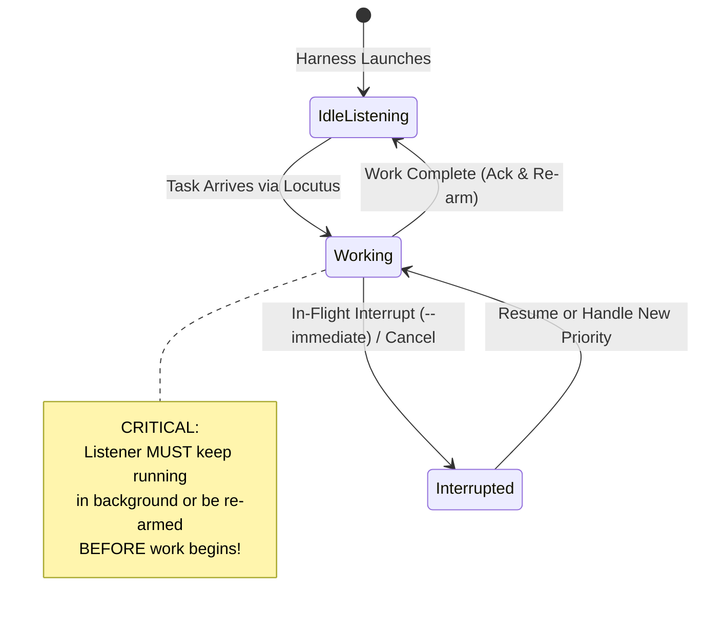

# Coding Harness Ear Verification Playbook (Continuous Listening & Preemption)

> **Development Guide for LLMs & Harness Engineers**  
> *This playbook is not distributed with the end-user `@axiomantic/locu` package. It lives in the repository to guide automated and manual testing of new coding harnesses, plugins, and ear extensions.*

---

## 1. The Crux: Why Computer Use & Why the Ear Flow?

### Why Headless Automated Tests Are Insufficient
Automated test suites (e.g. `pytest`, `nimble test`) effortlessly verify headless subprocesses: manual queue claiming (`locu claim`), mutex locks (`locu lock`), and Redis serialization. 

However, **headless tests cannot verify how an interactive coding harness behaves**:
- Does the harness's event loop actually stay responsive to background events?
- Does an incoming Redis message wake the harness from idle without human keyboard input?
- Does the harness keep listening **while** it is generating code or running tool calls?
- When an in-flight cancellation or high-priority interrupt arrives, does the harness abort/preempt, queue the prompt, or remain completely deaf until the turn finishes?
- Are there differences between the CLI, TUI, and Desktop GUI versions of the harness?

To answer these questions, we use **Computer Use** (`macos-mcp`, OS-level desktop automation, or harness-specific computer-use extensions) as a neutral external Conductor. The Conductor observes the actual UI, types the initial launch, and then **steps back** to observe autonomous routing.

---

## 2. The Invariants

### Invariant 1: The Autonomous Loop Invariant (Zero Babysitting)
Once a coding harness is launched, the operator **never types subsequent prompts into the harness window**. All subsequent instructions, handoffs, replies, and cancellations must flow exclusively over the **Locutus Redis bus** (`locu send`, `locu reply`, `locu cancel`).

### Invariant 2: The Continuous Listening (Ear) Invariant
To participate in an autonomous agent swarm, a coding harness must satisfy four lifecycle states:



1. **State 0: Idle Listening**
   - The harness arms its background listener by default upon startup (via in-process extension, daemon, or background task).
   - Registers heartbeat (`locutus:heartbeat:<agent>`) and listener lock (`locutus:listener:<agent>`) in Redis.
2. **State 1: Automatic Task Acceptance**
   - A message routed to `locutus:inbox:<agent>` wakes the harness immediately.
   - The harness accepts the prompt into its model context without human keyboard intervention.
3. **State 2: Continuous Listening While Working (Crucial Invariant)**
   - **The listener must continue running in the background while the harness executes tools and generates tokens.**
   - If a harness stops listening while working, it is **Deaf During Execution**. It cannot receive cancellation tokens, abort signals, or priority escalations until its current turn ends (which may take minutes or hang indefinitely).
4. **State 3: In-Flight Preemption / Interrupt Capability**
   - If an urgent message (`locu send --immediate`) or cancellation (`locu cancel`) arrives while the harness is in State 2:
     - **Full Preemption**: The harness aborts its active turn/tool call and immediately processes the interrupt.
     - **Context Injection**: The harness delivers the message into the active conversation buffer for the next step.
     - **Deaf Defect**: The harness ignores the message until the turn completes. (Must be classified and documented).
5. **State 4: Turn-End Re-Arming**
   - When the task completes (or errors), the harness acknowledges (`locu ack` or `locu reply`), finishes the turn, and **automatically returns to State 0 without human prompting**.

---

### Invariant 3: The Zero-Timeout / Infinite Block Invariant (Anti-Token-Thrash)
- **Default Must Always Be Infinite Wait (`timeout = 0` / no timeout)**.
- **Why Timeouts Cause Token Thrashing**: If a listener tool call or command uses a bounded timeout (e.g., 30s or 60s), the timer expiring returns an empty/timeout event back to the LLM. The model is forced to process its full context window, run reasoning/thinking, and emit another tool call just to re-listen. Over an hour of idling, a 30s timeout burns through 120 unnecessary turn cycles, wasting hundreds of thousands of tokens and racking up substantial API costs.
- **Redis Native Efficiency**: A Redis `BLPOP` or `BRPOP` with `timeout 0` blocks at the OS TCP socket level with 0 CPU usage, 0 network bandwidth, and **0 LLM token consumption**. It wakes only when a byte arrives.
- **Rule**: Timeouts are strictly optional, should never be the default, and must be explicitly discouraged across all prompts and skill instructions.

### Invariant 4: The Subagent Completion Barrier & "No Double-Daemons"
- **The Completion Barrier**: Subagents report output to their parent session only upon process exit. Subagents do not stream intermediate standard output lines back to the parent.
- **The Infinite Loop Trap**: Running an infinite streaming loop (`while true; do locutus listen; done`) or a background daemon *inside* a subagent traps messages inside the subagent container forever—the parent session never wakes up!
- **No Double-Daemons**: Inside a subagent container (which is already backgrounded by the parent), the command itself must be **synchronous and blocking** (`locutus listen <agent>`), one-and-done. It blocks on the Redis socket until 1 message arrives, prints the JSON payload, and terminates immediately so the parent session receives the notification.
- **Main Chat Preference**: Whenever the harness supports running background daemon tasks in the main chat (e.g. `run_command(IsDaemon=true)`), that is strictly preferred over subagents to eliminate subagent token overhead and provide a direct line of interruption.

---

## 3. Harness Architectural Taxonomy

Different coding harnesses handle concurrency and background events through fundamentally different mechanisms. When testing a new harness, identify its architecture:

| Harness Type | Example | Background Listening Mechanism | In-Flight Interrupt Capability |
| :--- | :--- | :--- | :--- |
| **In-Process Plugin** | OpenCode (`opencode-ear.js`), Pi (`pi-ear.ts`) | Background thread/event-loop spawning `locutus listen` with access to internal session client. | **High**: Can call `client.session.abort()` on `--immediate` to preempt busy sessions. |
| **Main-Chat Background Task** | Antigravity / AGY | Shell tool with native daemon/background support (`run_command(IsDaemon=true)`). Preferred over subagents. | **Medium/High**: Delivers background task messages at step boundaries automatically. |
| **Background Agent / Subagent** | Claude Code (`Task(background=true)`) | Dispatches dedicated background listener agent running synchronous blocking `locutus listen <agent>` (no timeout). | **High**: Background subagent terminates on arrival and notifies parent session. |
| **External Daemon** | Desktop IDEs, Headless Workers | Sidecar daemon writing to harness IPC socket or file watcher. | Depends on whether the harness exposes an abort/interrupt IPC endpoint. |

---

## 4. The 4-Step Verification Playbook

When onboarding or testing a coding harness using Computer Use (`macos-mcp` or equivalent), execute these 4 phases sequentially:

### Phase 1: Zero-Touch Idle Listen Verification
**Objective**: Verify the harness arms its listener automatically without manual CLI intervention.

1. **Launch**:
   Use computer use to launch the harness in its natural environment:
   - macOS Terminal / GUI: `tell application "Terminal" to do script "cd <dir> && export LOCUTUS_AGENT_NAME=<agent_name> && <harness_bin>"`
2. **Do Not Type Any Prompts**.
3. **Assert via Redis**:
   ```bash
   redis-cli exists locutus:heartbeat:<agent_name>
   redis-cli exists locutus:listener:<agent_name>
   locu who | grep <agent_name>
   ```
4. **Pass Criteria**:
   - Heartbeat key exists with active TTL (>0).
   - Listener registration exists.
   - `locu who` displays the agent as active.

---

### Phase 2: Autonomous Task Acceptance & Execution
**Objective**: Verify message routing wakes the harness and it works without typing into the window.

1. **Send Task over Redis**:
   ```bash
   locu send --to <agent_name> --subject "task" --body "touch /tmp/ear_verification.txt"
   ```
2. **Do Not Touch the Keyboard or Window**.
3. **Assert**:
   - Observe UI via Computer Use: Does the harness begin generating tool calls?
   - File system: Does `/tmp/ear_verification.txt` get created?
   - Redis: Does the agent send a completion reply or ack?

---

### Phase 3: In-Flight Interrupt & Preemption Verification
**Objective**: Verify the harness can receive and process high-urgency messages (`--immediate`) while actively working on a previous prompt.

1. **Dispatch Long-Running Task**:
   ```bash
   locu send --to <agent_name> --subject "long_task" --body "sleep 45 && touch /tmp/should_be_aborted.txt"
   ```
2. **Wait for Harness to Enter Working State**:
   Confirm via process list or harness logs that `sleep 45` has started.
3. **Dispatch Immediate Cancellation**:
   ```bash
   locu send --to <agent_name> --immediate --subject "abort" --body '{"interrupt": "ABORT_AND_ROLLBACK"}'
   ```
4. **Observe Behavior**:
   - **Pass (Preemptible)**:
     - The harness immediately interrupts/kills `sleep 45`.
     - `/tmp/should_be_aborted.txt` is **never created**.
     - The listener remains active in the background.
   - **Fail (Busy Deafness - EAR-03)**:
     - `/tmp/should_be_aborted.txt` is created after 45 seconds.
     - Only after completion does the harness see the abort message.
5. **Classification**:
   Record whether the harness supports true preemption or exhibits the **Deaf-While-Busy Defect**.

---

### Phase 4: Turn-End Re-Arming & P2P Handoff
**Objective**: Verify the harness re-arms its listener after completing a turn, and can exchange peer-to-peer routed messages with another agent.

1. **Verify Idle Re-Arming**:
   After Phase 3 completes and the harness returns to idle, verify Redis:
   ```bash
   redis-cli ttl locutus:heartbeat:<agent_name>
   redis-cli get locutus:listener:<agent_name>
   ```
2. **Peer-to-Peer Handoff Flow**:
   - Harness A (`worker-alpha`) receives a task instructing it to create a file and notify Harness B (`worker-beta`):
     ```bash
     locu send --to worker-alpha --subject "chain-step-1" --body '{"cmd":"touch /tmp/step1.txt && locu send --to worker-beta --subject chain-step-2 --body ready"}'
     ```
   - Verify that:
     1. `worker-alpha` executes step 1 and sends message to `worker-beta`.
     2. `worker-beta` automatically wakes from idle, receives `chain-step-2`, and executes its part.
     3. Both workers automatically return to idle listening.
3. **Pass Criteria**:
   - Zero human reprompts.
   - Both agents remained responsive and re-armed listeners.

---

## 5. Defect Severity & Classification Rubric

When testing any coding harness, classify findings according to this rubric:

| Defect Code | Name | Description | Mitigation / Guidance |
| :--- | :--- | :--- | :--- |
| **EAR-01** | **Startup Deafness** | Harness does not arm listener on launch; requires manual command. | Install in-process extension, shell profile wrapper, or SessionStart hook. |
| **EAR-02** | **Post-Turn Deafness** | Harness processes 1 message, then exits listener and goes silent. | Implement auto-rearming loop in ear extension or harness `Stop` hook. |
| **EAR-03** | **Busy Deafness** | Listener terminates or blocks during turn execution; cannot receive interrupts. | Decouple listener thread/process from model execution loop. |
| **EAR-04** | **Unpreemptible Turn** | Listener receives interrupt while busy, but harness has no abort/cancel API. | Document as non-preemptible; rely on cooperative fencing tokens (`locu check-cancel`). |
| **EAR-05** | **Simulated Execution (Green Mirage)** | Model outputs simulated completion text without invoking tools. | Enforce rigid system prompts, tool call validation, or pre-checks (e.g. `git status --porcelain`). |

---

## 6. Playbook Maintenance

- When adding support for a new coding harness (e.g. Cursor, Windsurf, Claude Desktop, Devin), run this verification suite using the appropriate computer-use MCP.
- Record the architectural taxonomy and defect classification in this document.
- Never commit test artifacts or workspace identity files (`.locutus.agent`, `.braid.agent`).

---

## 7. Empirical Case Study: Multi-Harness Desktop Verification Findings

### OpenCode Desktop (`ai.opencode.desktop`)
- **Architecture**: In-process JS/TS plugin architecture (`skills/locutus/opencode-ear.js` installed to `~/.config/opencode/plugins/`).
- **Runtime Discrepancy**: The `opencode` CLI executes under Bun, whereas OpenCode Desktop runs under Electron (Node.js). Spawning listeners with `Bun.spawn` alone causes silent startup deafness in the desktop app. Using dual runtime detection (`typeof Bun !== "undefined" && Bun?.spawn` vs `node:child_process.spawn` + `node:readline.createInterface`) guarantees universal compatibility.
- **Session Auto-Mapping**: Fresh GUI tabs open as draft composers before database persistence. Session listener auto-registration hooks into `session.created`, `syncSessions`, and `shell.env` to resolve agent identity and spin up `locutus listen <agent>` in the background.
- **Autonomous Execution (Phase 2)**: Verified. OpenCode accepted a routed task over Redis and executed `git status` without human intervention.
- **In-Flight Preemption (Phase 3)**: Verified. While executing a 20-second background sleep command, an incoming `--immediate` cancellation message triggered `client.session.abort()`, preempting the active fiber at 1.27s and leaving the background listener active and re-armed (PID 57708). Immune to EAR-01, EAR-02, EAR-03, and EAR-04.

### Claude Architecture: Synchronous Blocking Anti-Pattern vs. Background Subagents
- **Why Synchronous Blocking in the Main Chat is an Anti-Pattern**:
  1. **Chat Interactivity Freezing**: In Claude, calling a blocking listen tool synchronously in the primary turn freezes the active conversation—the user cannot type messages, Claude cannot execute any other tools, and the conversation cannot progress.
  2. **Catastrophic Token Thrash from Timeouts**: Adding a 30-second or 60-second timeout to unblock a synchronous call creates severe token thrashing. Every time the timeout expires, Claude must process its entire context history, run internal reasoning, and emit another tool call just to re-listen. Over an hour, a 30s timeout generates 120 empty wakeups, wasting millions of tokens and racking up substantial API costs.
- **The Execution Discipline: Background Subagents with Synchronous Blocking Execution**:
  - **No Double-Daemons & Completion Barrier**: Coding assistant subagents report output only upon exit (they do not stream intermediate standard output lines back to the parent session). An infinite loop or daemon process inside a subagent traps messages inside the subagent forever.
  - Therefore, the subagent container itself is backgrounded by the parent (`Task(..., background=true)`), but inside the container, the command MUST BE **synchronous and blocking** (`locutus listen <agent>` with no timeout). It waits on Redis until 1 message arrives, prints it, and exits cleanly to deliver the payload.
  - **Zero Blocking**: The primary chat session remains 100% interactive and responsive.
  - **Asynchronous Wakeup**: When the subagent terminates upon message arrival, the platform delivers the notification into the parent session.
- **Token Efficiency Hierarchy**: If a harness supports direct main-chat background daemon commands (e.g. `run_command(IsDaemon=true)`), that is strictly preferred over subagents to eliminate subagent LLM inference overhead and provide an immediate line of interruption.

### Antigravity Desktop (`com.google.antigravity`)
- **Architecture**: Standalone developer IDE equipped with reactive agentic messaging, background process execution (`run_command`), and MCP tools.
- **Concurrency & Wakeup**: Antigravity agents do not need to poll. Spawning `locutus listen <agent>` as a background daemon process (`IsDaemon: true`) allows the platform to reactively wake the agent when a message line arrives with zero polling and zero token thrash.
- **Recommended Pattern**: Run the listener via background daemon task with no timeout to maintain 24/7 ambient readiness.

